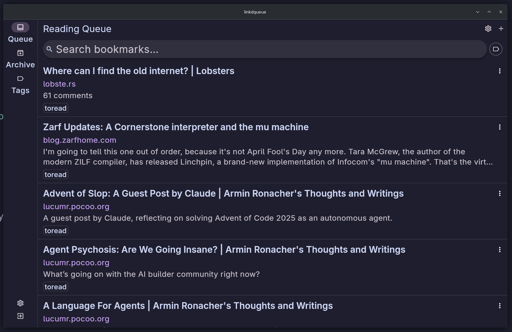
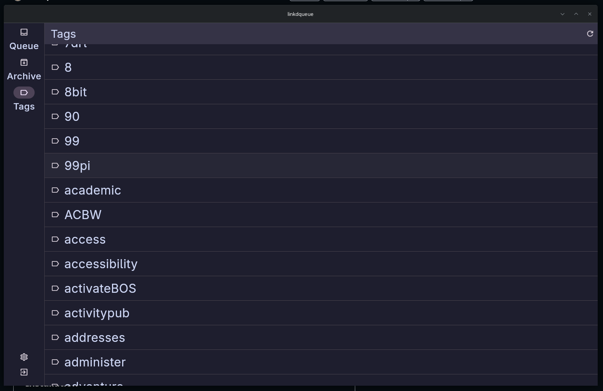

# Linkdqueue


A reading queue manager for [Linkding](https://github.com/sissbruecker/linkding) bookmarks. Browse your unread bookmarks, filter by tag, mark articles as read, and manage tags — all from a native desktop or mobile app.

## Installation

Download the latest release for your platform from the [Releases](../../releases) page.

### macOS

1. Download `linkdqueue-macos.zip` and unzip it.
2. Move `linkdqueue.app` to your `/Applications` folder.
3. On first launch, right-click the app and choose **Open** to bypass Gatekeeper (required once for apps not from the App Store).

### Linux

1. Download `linkdqueue-linux.tar.gz` and extract it:
   ```bash
   tar -xzvf linkdqueue-linux.tar.gz -C ~/Applications/linkdqueue
   ```
2. Install the runtime dependency for secure credential storage:
   ```bash
   # Debian / Ubuntu
   sudo apt install libsecret-1-0

   # Fedora / RHEL
   sudo dnf install libsecret

   # Arch
   sudo pacman -S libsecret
   ```
3. Run the app:
   ```bash
   ~/Applications/linkdqueue/linkdqueue
   ```
   Optionally create a desktop shortcut pointing to that path.

### Windows

1. Download `linkdqueue-windows.zip` and unzip it to a folder of your choice (e.g. `C:\Program Files\Linkdqueue`).
2. Run `linkdqueue.exe` inside that folder.
3. Optionally right-click `linkdqueue.exe` and choose **Pin to Start** or **Send to > Desktop (create shortcut)**.

## Setup

On first launch you will be prompted for your Linkding connection details:

- **Linkding URL** — the base URL of your Linkding instance (e.g. `https://linkding.example.com`)
- **API Token** — found in Linkding under **Settings > Integrations**

Use **Test Connection** to verify before saving.

## Features


- Browse your unread bookmark queue with infinite scroll
- Filter by tag or free-text search
- Mark bookmarks as read, archive, or delete
- Edit tags on any bookmark
- Swipe actions on mobile (mark read, archive)
- Adjustable text size and colour theme
- Tags view will show all articles with tag when you click
